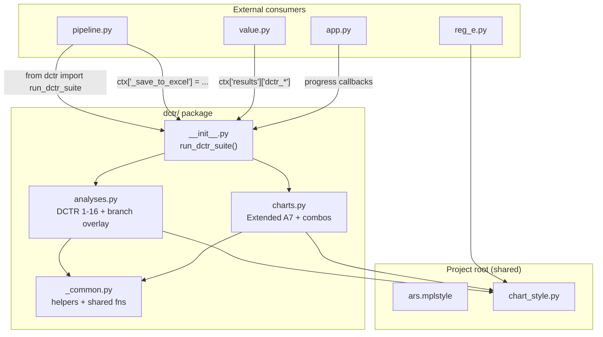

# feat: DCTR Section Overhaul — Curation, Visual Polish, and Code Refactor

**Type:** enhancement
**Module:** `dctr.py` (2,644 lines), `pipeline.py` (slide consolidation)
**Branch:** `feat/dctr-overhaul` (from `main`)
**Date:** 2026-02-07

---

## Enhancement Summary

**Deepened on:** 2026-02-07
**Research agents used:** kieran-python-reviewer, architecture-strategist, performance-oracle, code-simplicity-reviewer, pattern-recognition-specialist, spec-flow-analyzer, best-practices-researcher

### Key Improvements from Research
1. **Simplified architecture** — Reduced from 10 submodules to 5 based on simplicity and pattern analysis reviews
2. **chart_style.py redesigned** — Constants-only module (no `apply_standard_style()` function); use a `.mplstyle` file for rcParams instead
3. **Performance fixes added** — Pre-parse `Date Opened` once (saves ~400ms), cache `_branch_dctr()` results (saves ~50ms), add `plt.close` leak guards
4. **Edge case handling** — Fallback strategy for partial combo failures, single-branch handling, empty L12M data
5. **Slide routing simplified** — Define only `DCTR_MAIN_IDS` (3 items); derive appendix by exclusion instead of maintaining two lists
6. **Bug fix: R23 line color** — Changed from red (`NEGATIVE`) to teal (`TEAL`) since DCTR is a positive metric
7. **Circular import risk eliminated** — Inject `save_to_excel` via `ctx` before calling suite, removing the `from pipeline import` inside dctr
8. **~400 duplicate lines identified** — Funnel drawing (~130 lines), comparison bars (~60 lines), branch merge boilerplate (~24 lines), chart axis styling (~50 lines)

### Critical Issues Discovered
- `run_dctr_branch_overlay` was listed in both `branch.py` and `combo_slides.py` — resolved: lives in `branch.py` only
- `visualizations.py` at 900 lines would exceed the 400-line file limit — resolved: split across multiple files
- Appendix count was incorrectly stated as "14" but is actually 16 — corrected
- `DCTR_MAIN_IDS` must be an ordered list (not a set) to guarantee slide order

---

## Overview

Overhaul the DCTR (Debit Card Take Rate) section to close the gap between the current exhaustive 17-slide output and the curated 3-slide reference standard. This plan covers four workstreams:

1. **Curate/reduce** — Match the reference deck's 3-content-slide structure (funnel, comparison, branch) while preserving all 17 analyses for the appendix
2. **Fix visuals** — Standardize chart formatting, remove inconsistencies, improve readability
3. **Add new analyses** — Fill gaps identified from the reference (combo funnel+decade, branch volume+DCTR overlay)
4. **Refactor code** — Break the 2,644-line monolith into focused submodules

---

## Problem Statement

The DCTR section currently generates 17 individual slides but the human-curated reference deck (First Central CU) condenses the entire DCTR story into just **3 content slides + 1 divider**:

| Ref Slide | Content | Current Equivalent |
|-----------|---------|-------------------|
| R21 | Funnel (left) + DCTR by Decade (right) | `A7.7` funnel exists but no combo with decade |
| R22 | Historical vs TTM (left) + Open vs Eligible (right) | `A7` combo slide exists (close match) |
| R23 | Branch volume bars + DCTR line overlay | `A7.10a` exists but uses grouped bars, not bar+line |

**Problems with the current output:**
- 17 slides overwhelms the client — most belongs in appendix
- The 3 main-body DCTR slides don't match the reference compositions
- Chart formatting inconsistencies: mixed edge styles (some `edgecolor='black'`, some `'none'`), inconsistent font sizes across chart types, some charts use grid, others don't
- Code is a 2,644-line single file with repeated patterns — hard to maintain and extend
- The consolidation logic in `pipeline.py` merges pairs that don't match the reference pairings
- ~400 lines of duplicated code across funnel charts, comparison bars, branch merges, and axis styling

### Research Insights: Code Duplication Metrics

| Duplication Pattern | Occurrences | Lines per Instance | Saveable Lines |
|---------------------|-------------|-------------------|----------------|
| Funnel chart (full body) | 2 | ~130 each | ~130 |
| Comparison bar chart | 5 | ~15 each | ~60 |
| Branch hist/L12M merge | 3 | ~12 each | ~24 |
| Chart axis styling | ~15 charts | ~4 each | ~50 |
| `pd.to_datetime('Date Opened')` | 15 | ~1 each | ~12 |
| Cross-module helpers (`_report`, `_fig`, etc.) | 4 modules | ~35 each | ~105 |
| **Total** | | | **~403** |

---

## Proposed Solution

### Architecture (Simplified — 5 Files)

Based on simplicity review: reduced from the original 10-file proposal to 5 files that follow actual dependency clusters rather than conceptual taxonomy.

```
dctr/
  __init__.py        # run_dctr_suite() orchestrator, DCTR_ORDER, slide ordering (~120 lines)
  _common.py         # Helpers + categorization + shared analysis fns (~315 lines)
  analyses.py        # run_dctr_1 through run_dctr_16, branch_overlay (~730 lines)
  charts.py          # Extended A7 visualizations + combo slides (~1,200 lines)
  chart_style.py     # Constants only — colors, font sizes, bar edge style (~35 lines)
```

Additionally, at the project root (shared across dctr, reg_e, value):

```
ars_analysis-jupyter/
  ars.mplstyle       # matplotlib rcParams style sheet (~30 lines)
  chart_style.py     # Project-wide chart constants (moved from dctr/) (~35 lines)
```

### Research Insight: Why 5 Files, Not 10

The simplicity reviewer found that:
- `_helpers.py` (60 lines) + `_categories.py` (60 lines) + `_shared.py` (100 lines) = 220 lines with a dependency chain between them. One `_common.py` is simpler.
- `core.py` + `branch.py` + `demographics.py` share the same import set and the same function pattern. They form one natural `analyses.py`.
- `combo_slides.py` at 150 lines / 3 functions is too thin for its own file. The combo functions belong in `charts.py`.
- `run_dctr_branch_overlay` was listed in both `branch.py` and `combo_slides.py` — resolving it into `analyses.py` (since it's a branch-domain analysis) eliminates the ambiguity.

### Research Insight: chart_style.py — Constants Only, No Wrapper Function

The `apply_standard_style()` function proposed in the original plan is premature abstraction. At least 5 of 17 chart functions need different formatting:
- Heatmap: no y-axis percentage, needs colorbar, different spine rules
- Funnels: `ax.axis('off')`, no axis formatting at all
- Seasonality: 3 subplots, each with different tick labels
- Decade trend: custom y-limits, `int(x)%` format
- Branch overlay: dual axes (twinx), each axis needs different formatting

Instead, use a **`.mplstyle` file** for rcParams-eligible defaults and a **constants module** for named values. Each chart function applies constants directly — 2 lines of `ax.spines` calls is better than fighting a one-size-fits-all wrapper.

### Research Insight: Place chart_style.py at Project Root

The architecture reviewer noted that `reg_e.py` has the exact same style inconsistencies and duplicated helpers as `dctr.py`. Placing `chart_style.py` inside `dctr/` would force `reg_e.py` to cross-import from `dctr.chart_style` — a layering violation. Instead, `chart_style.py` lives at the project root so both `dctr/` and `reg_e.py` (and eventually a `reg_e/` package) import from the same source.

### Slide Curation Strategy

After all 17 analyses run, the consolidation produces:

**Main Body (3 slides):**
1. **R21-match:** Funnel + Decade combo (NEW — `A7.7` left + `A7.5` right)
2. **R22-match:** DCTR Comparison combo (EXISTS — `A7` already pairs Open vs Eligible + Hist vs TTM)
3. **R23-match:** Branch Performance overlay (REWORK — bar+line chart replacing grouped bars)

**Appendix (remaining 16 slides):**
All other DCTR slides move to appendix in narrative order.

---

## Technical Approach

### Phase 1: Style + Visual Polish (Combined — One Pass)

The original plan separated this into 3 phases (Phase 1: Style Standardization, Phase 3: Visual Polish, Phase 5: Visual Audit). The simplicity reviewer correctly identified that these are the same work — a single pass through all chart functions replacing hardcoded values with constants.

**Create `ars.mplstyle` at project root:**

```ini
# ars.mplstyle — ARS presentation chart defaults
# Usage: plt.style.use('./ars.mplstyle')

font.family      : sans-serif
font.size        : 12
axes.titlesize   : 22
axes.titleweight : bold
axes.titlepad    : 20
axes.labelsize   : 18
axes.labelweight : bold
axes.spines.top  : False
axes.spines.right: False
axes.grid        : False
axes.facecolor   : white
axes.axisbelow   : True
xtick.labelsize  : 16
ytick.labelsize  : 16
legend.fontsize  : 14
legend.framealpha: 0.9
legend.fancybox  : True
figure.facecolor : white
figure.dpi       : 100
savefig.dpi      : 200
savefig.facecolor: white
savefig.bbox     : tight
lines.linewidth  : 2.5
lines.markersize : 8
```

**Create `chart_style.py` at project root (constants only):**

```python
# chart_style.py — Shared chart constants for dctr, reg_e, value, mailer modules

# Semantic colors
PERSONAL = '#4472C4'
BUSINESS = '#ED7D31'
HISTORICAL = '#5B9BD5'
TTM = '#FFC000'
ELIGIBLE = '#70AD47'
POSITIVE = '#27AE60'
NEGATIVE = '#E74C3C'
NEUTRAL = '#95A5A6'
SILVER = '#BDC3C7'
TEAL = '#2E86AB'

# Presentation font sizes (for per-call overrides beyond rcParams)
TITLE_SIZE = 24
AXIS_LABEL_SIZE = 20
DATA_LABEL_SIZE = 20
TICK_SIZE = 18
LEGEND_SIZE = 16
ANNOTATION_SIZE = 18

# Bar chart defaults
BAR_EDGE = 'none'
BAR_ALPHA = 0.9

# Percentage formatter (pre-instantiated, reuse everywhere)
from matplotlib.ticker import FuncFormatter
PCT_FORMATTER = FuncFormatter(lambda x, p: f'{x:.0f}%')
```

### Research Insight: DPI 200 and Matched Figure Sizes

The best-practices researcher found that the current DPI 150 produces text that is marginal for projected presentations. DPI 200 gives crisp text without excessive file sizes. Additionally, the oversized figures (28x14, 18x12) waste rendering time and memory — text shrinks on insertion into PowerPoint, negating the large canvas.

**Figure size recommendations matched to slide content areas:**

| Layout | Available Area | Ideal figsize at DPI 200 |
|--------|---------------|-------------------------|
| Full-width (12, 13) | 12.0" x 5.0" | (12, 5) |
| Standard (11) | 8.5" x 5.0" | (10, 5.5) |
| Side-by-side (6, 7) | 5.8" x 5.0" | (6, 5) |
| With KPI sidebar (10) | 7.8" x 5.0" | (10, 6) |

**Current inconsistencies to fix in one pass:**

| Chart | Issue | Fix |
|-------|-------|-----|
| All bar charts (5 functions) | `edgecolor='black'` | Change to `BAR_EDGE` (`'none'`) |
| `run_dctr_funnel` | Title 28pt | Use `TITLE_SIZE` (24pt) |
| `run_dctr_heatmap` | Cell text 12pt, ticks 14pt | Use `DATA_LABEL_SIZE` / `TICK_SIZE` |
| `run_dctr_seasonality` | Figure width hardcoded 22 | Compute: `max(14, n_subplots * 7)` |
| `run_dctr_branch_l12m` | Figure (28, 14) | Reduce to (14, max(8, n_branches * 0.5)) |
| `run_dctr_vintage` | Figure 18x12 | Scale to (14, 8) |
| All delta annotations | `linewidth=2` | Standardize to `linewidth=1.5` |

**Acceptance Criteria:**
- [ ] `ars.mplstyle` created and loaded via `plt.style.use()` at start of `run_dctr_suite()`
- [ ] `chart_style.py` at project root with constants only (no functions)
- [ ] Zero `edgecolor='black'` in bar charts
- [ ] All hardcoded font sizes replaced with `chart_style` constant imports
- [ ] All hardcoded colors replaced with `chart_style` constant imports
- [ ] `savefig.dpi` set to 200 in `ars.mplstyle`
- [ ] Oversized figures (28x14, 18x12) reduced to match slide content areas
- [ ] `FuncFormatter` pre-instantiated as `PCT_FORMATTER` constant (not recreated per call)

### Phase 2: New Combo Slides + Consolidation Rework

#### 2A: R21-Match — Funnel + Decade Combo

The reference slide R21 shows:
- **Left:** Performance funnel (Total -> Open -> Eligible -> With Debit)
- **Right:** DCTR by decade line chart with P/B overlay

**Implementation — add chart path storage first:**

```python
# In run_dctr_funnel(), inside the try block, immediately after _save_chart():
cp = _save_chart(fig, chart_dir / 'dctr_funnel.png')
ctx['results']['dctr_funnel_chart'] = cp   # <-- ADD THIS LINE

# In run_dctr_decade_trend(), inside the try block, immediately after _save_chart():
cp = _save_chart(fig, chart_dir / 'dctr_decade_trend.png')
ctx['results']['dctr_decade_chart'] = cp   # <-- ADD THIS LINE
```

**Then add the combo function:**

```python
def run_dctr_funnel_decade_combo(ctx):
    """R21-match: Funnel (left) + Decade trend (right)."""
    funnel_path = ctx['results'].get('dctr_funnel_chart')
    decade_path = ctx['results'].get('dctr_decade_chart')

    if not funnel_path and not decade_path:
        _report(ctx, "   Both funnel and decade charts missing — skipping R21 combo")
        return ctx

    # Fallback: if only one chart exists, use single-chart layout
    if not funnel_path or not decade_path:
        available = funnel_path or decade_path
        _report(ctx, f"   Partial R21 — using single chart fallback")
        _slide(ctx, 'A7.R21 - Funnel + Decade', {
            'title': 'Debit Card Performance',
            'chart_path': available,
            'layout_index': 9,  # Single full-width chart
        })
        return ctx

    through = ctx['results'].get('dctr_funnel', {}).get('through_rate', 0)
    _slide(ctx, 'A7.R21 - Funnel + Decade', {
        'title': 'Debit Card Performance Funnel',
        'subtitle': f'{through:.1f}% end-to-end conversion — DCTR trend by account vintage',
        'chart_path': funnel_path,
        'chart_path_2': decade_path,
        'slide_type': 'multi_screenshot',
        'layout_index': 6,
    })
    return ctx
```

### Research Insight: Partial Failure Fallback

The spec-flow analyzer identified that without fallback handling, a client with no L12M data would see only 1 DCTR slide in the main body (R21 survives because it uses historical data; R22 and R23 both fail because they need L12M). The combo functions now include fallback to single-chart layout when one source is missing, and pipeline should log a warning when fewer than 3 main-body slides are generated.

#### 2B: R22-Match — DCTR Comparison (Already Exists)

Current `A7 - DCTR Comparison` combo already pairs Open vs Eligible + Hist vs TTM. **No changes needed.**

#### 2C: R23-Match — Branch Performance Overlay (New Chart Type)

```python
def run_dctr_branch_overlay(ctx):
    """R23-match: Branch volume bars (left axis) + DCTR line (right axis).
    Lives in analyses.py (branch domain), not combo_slides.
    """
    bm = ctx['config'].get('BranchMapping', {})

    # Reuse cached branch data if available (performance: avoids 5th redundant _branch_dctr call)
    branch_df = ctx['results'].get('_branch_l12m_df')
    if branch_df is None:
        branch_df, _ = _branch_dctr(ctx['eligible_last_12m'], bm)

    if branch_df.empty:
        _report(ctx, "   No branch data — skipping R23 overlay")
        return ctx

    df = branch_df[branch_df['Branch'] != 'TOTAL'].sort_values('Total Accounts', ascending=False)

    # Skip if only 1 branch — bar+line with single point adds no analytical value
    if len(df) < 2:
        _report(ctx, "   Single branch — skipping R23 overlay (no comparative dimension)")
        return ctx

    fig = None
    try:
        fig, ax1 = plt.subplots(figsize=(12, 5))
        x = range(len(df))

        # Bars: account volume
        ax1.bar(x, df['Total Accounts'], color=TEAL, alpha=BAR_ALPHA, edgecolor=BAR_EDGE,
                label='Account Volume')
        ax1.set_ylabel('Account Volume', fontsize=AXIS_LABEL_SIZE, fontweight='bold', color='#555555')
        ax1.tick_params(axis='y', labelsize=TICK_SIZE, colors='#555555')
        ax1.grid(True, axis='y', alpha=0.2, linestyle='--')
        ax1.set_axisbelow(True)

        # Line: DCTR % — use TEAL (not red) since DCTR is a positive metric
        ax2 = ax1.twinx()
        line_color = HISTORICAL  # Blue, not red
        ax2.plot(x, df['DCTR %'].values * 100, 'o-', color=line_color, linewidth=3, markersize=10,
                 label='DCTR %')
        ax2.set_ylabel('DCTR (%)', fontsize=AXIS_LABEL_SIZE, fontweight='bold', color=line_color)
        ax2.tick_params(axis='y', labelsize=TICK_SIZE, labelcolor=line_color)
        ax2.yaxis.set_major_formatter(PCT_FORMATTER)
        ax2.set_ylim(bottom=0)
        ax2.grid(False)
        ax2.spines['top'].set_visible(False)

        # Data labels on line points
        for i, (_, row) in enumerate(df.iterrows()):
            ax2.text(i, row['DCTR %'] * 100 + 1.5, f"{row['DCTR %']*100:.0f}%",
                     ha='center', fontsize=14, fontweight='bold', color=line_color)

        ax1.set_xticks(x)
        ax1.set_xticklabels(df['Branch'].values, rotation=45, ha='right', fontsize=14)
        ax1.set_title('Branch Performance: Volume & DCTR', fontsize=TITLE_SIZE,
                       fontweight='bold', pad=20)
        ax1.spines['top'].set_visible(False)

        # Combined legend
        h1, l1 = ax1.get_legend_handles_labels()
        h2, l2 = ax2.get_legend_handles_labels()
        ax2.legend(h1 + h2, l1 + l2, loc='upper right', fontsize=LEGEND_SIZE)

        plt.tight_layout()
        cp = _save_chart(fig, ctx['chart_dir'] / 'dctr_branch_overlay.png')
        fig = None  # _save_chart closed it

        top_branch = df.iloc[0]['Branch']
        top_dctr = df.iloc[0]['DCTR %'] * 100
        _slide(ctx, 'A7.R23 - Branch Performance', {
            'title': 'Branch Performance: Volume & DCTR',
            'subtitle': f"Largest: {top_branch} ({top_dctr:.0f}% DCTR) — {len(df)} branches analyzed",
            'chart_path': cp,
            'layout_index': 13,
        })
    except Exception as e:
        _report(ctx, f"   Branch overlay chart: {e}")
    finally:
        if fig is not None:
            plt.close(fig)

    return ctx
```

### Research Insight: twinx Best Practices

The best-practices researcher found these critical patterns for dual-axis charts:
- Color-match y-axis labels and ticks to their data series (volume axis = gray, DCTR axis = blue)
- Set `ax2.set_ylim(bottom=0)` to prevent misleading visual relationships
- Disable grid on twin axis (`ax2.grid(False)`) — only grid on primary
- Use `try/finally` with `plt.close(fig)` guard to prevent figure memory leaks on exceptions
- Use combined legend via `get_legend_handles_labels()` on both axes

### Research Insight: R23 Line Color

The spec-flow analyzer flagged that `NEGATIVE = '#E74C3C'` (red) is semantically wrong for DCTR, which is a positive performance metric (higher is better). Changed to `HISTORICAL = '#5B9BD5'` (blue), which is neutral and matches the DCTR brand color used elsewhere.

#### Consolidation Rework (pipeline.py)

**Simplified approach — define main only, derive appendix by exclusion:**

```python
# In pipeline.py — replace DCTR_MERGES + DCTR_APPENDIX_IDS with:

# Ordered list (not set!) to guarantee slide order in main body
DCTR_MAIN_IDS = [
    'A7.R21 - Funnel + Decade',      # R21 match
    'A7 - DCTR Comparison',           # R22 match (existing)
    'A7.R23 - Branch Performance',    # R23 match (new)
]

DCTR_MERGES = []  # Combos now created in dctr module directly

# In _consolidate(), change appendix routing:
# Everything with category='DCTR' that is NOT in DCTR_MAIN_IDS goes to appendix
```

**Add warning for partial main body:**

```python
# After consolidation in _reorder_analysis_slides():
main_count = len(dctr_main)
if main_count < 3:
    _report(ctx, f"   WARNING: Only {main_count} of 3 expected DCTR main slides generated")
```

**Acceptance Criteria:**
- [ ] `DCTR_MAIN_IDS` is an ordered list (not a set)
- [ ] `DCTR_APPENDIX_IDS` removed — appendix derived by exclusion from main list
- [ ] `DCTR_MERGES` set to empty list
- [ ] Warning logged when fewer than 3 main-body slides are generated
- [ ] `DCTR_ORDER` in `run_dctr_suite()` updated to include new slide IDs
- [ ] New combo functions wired into `run_dctr_suite()` after `run_dctr_combo_slide` (line 2604)
- [ ] `value.py` downstream reads still work (reads from `ctx['results']`, not slide IDs)
- [ ] Main body has exactly 3 DCTR content slides (or fewer with warning if data is missing)

### Phase 3: Performance Optimizations + Code Refactor

#### 3A: Performance Fixes (Before Refactor)

The performance oracle identified three high-impact optimizations that should be applied before the refactor to establish a faster baseline:

**Fix 1: Pre-parse `Date Opened` once (~400ms savings)**

`pd.to_datetime(df['Date Opened'], errors='coerce')` appears 14 times across the module. Add at the top of `run_dctr_suite()`:

```python
def run_dctr_suite(ctx):
    # Pre-parse dates once for all analyses
    for key in ['eligible_data', 'open_accounts', 'eligible_last_12m',
                'eligible_personal', 'eligible_business',
                'eligible_personal_last_12m', 'eligible_business_last_12m']:
        df = ctx.get(key)
        if df is not None and not df.empty and 'Date Opened' in df.columns:
            if not pd.api.types.is_datetime64_any_dtype(df['Date Opened']):
                ctx[key]['Date Opened'] = pd.to_datetime(
                    df['Date Opened'], errors='coerce')
```

Then remove all per-function `pd.to_datetime('Date Opened')` calls.

**Fix 2: Cache `_branch_dctr()` results (~50ms + 4 fewer DataFrame copies)**

`_branch_dctr()` is called 8 times for only 4 unique dataset/mapping combinations. After `run_dctr_9` computes branch results:

```python
# In run_dctr_9, after computing branch data:
ctx['results']['_branch_hist_df'] = br_all
ctx['results']['_branch_l12m_df'] = br_l12

# In run_dctr_branch_trend, run_dctr_branch_l12m, run_dctr_branch_overlay:
hist_df = ctx['results'].get('_branch_hist_df')
if hist_df is None:
    hist_df, _ = _branch_dctr(ctx['eligible_data'], bm)
```

**Fix 3: Figure leak guards on all chart try/except blocks**

Every chart function wraps rendering in `try/except` but never closes the figure on exception. Add `finally` blocks:

```python
fig = None
try:
    fig, ax = plt.subplots(...)
    # ... chart logic ...
    _save_chart(fig, path)
    fig = None  # _save_chart already closed it
finally:
    if fig is not None:
        plt.close(fig)
```

**Fix 4: Eliminate circular import risk**

Currently `run_dctr_suite` does `from pipeline import save_to_excel` inside the function body. Instead, have pipeline.py inject it before calling:

```python
# In pipeline.py, before calling run_dctr_suite:
ctx['_save_to_excel'] = save_to_excel
ctx = run_dctr_suite(ctx)

# In run_dctr_suite, remove the import line entirely
```

#### 3B: Code Refactor (dctr/ package — 5 files)

**Migration strategy (atomic — one commit):**
1. Create `dctr/` directory with all 5 files
2. Move all functions from `dctr.py` into the appropriate submodule
3. Create `dctr/__init__.py` with `run_dctr_suite()` orchestrator
4. Test that `from dctr import run_dctr_suite` works
5. Run full pipeline end-to-end
6. Verify all 17+ slides, all Excel exports, value.py reads
7. Delete old `dctr.py`
8. Commit as single atomic change

**File breakdown:**

| New File | Functions | Lines (est) |
|----------|----------|-------------|
| `dctr/__init__.py` | `run_dctr_suite()`, `DCTR_ORDER` | ~120 |
| `dctr/_common.py` | `report`, `fig`, `save_chart`, `slide`, `dctr_rate`, `save`, `total_row`, `AGE_ORDER`, `HOLDER_AGE_ORDER`, `BALANCE_ORDER`, categorization fns, `analyze_historical_dctr`, `_l12m_monthly`, `_branch_dctr`, `_by_dimension`, `_crosstab` | ~315 |
| `dctr/analyses.py` | `run_dctr_1` through `run_dctr_16`, `run_dctr_branch_trend`, `run_dctr_branch_l12m`, `run_dctr_branch_overlay` | ~730 |
| `dctr/charts.py` | `segment_trends`, `decade_trend`, `decade_pb`, `l12m_trend`, `funnel`, `l12m_funnel`, `eligible_vs_non`, `heatmap`, `seasonality`, `vintage`, `combo_slide`, `funnel_decade_combo` | ~1,200 |
| **Total** | | **~2,365** (reduced from 2,644 via dedup + shared helpers) |

**Import pattern — use relative imports:**

```python
# dctr/analyses.py
from ._common import report, fig, save_chart, slide, dctr_rate, save, analyze_historical_dctr
from chart_style import PERSONAL, BUSINESS, HISTORICAL, TTM, BAR_EDGE, BAR_ALPHA, TITLE_SIZE
```

### Research Insight: Naming — Drop Underscores Inside _common.py

The Python reviewer noted that `_common._report` is redundant double-underscoring. The module-level underscore (`_common.py`) already signals "internal to this package." Functions inside should have clean names: `report`, `fig`, `save_chart`, `slide`, `dctr_rate` (renamed from `_dctr` for clarity), `save`, `total_row`.

### Research Insight: Extract Funnel Drawing Helper (~130 Lines Saved)

The pattern recognizer found `run_dctr_funnel` and `run_dctr_l12m_funnel` are 150+ lines each with near-identical `FancyBboxPatch` drawing logic. Extract a shared `_draw_funnel_stages(ax, stages, title, subtitle, has_biz)` helper in `charts.py`.

### Research Insight: Extract Comparison Bar Helper (~60 Lines Saved)

The "two-bar comparison with % on top + count inside" pattern repeats 5 times. Extract `_comparison_bars(ax, categories, values, colors, counts)` in `_common.py`.

**Acceptance Criteria:**
- [ ] `from dctr import run_dctr_suite` still works (backward compatible import)
- [ ] No circular imports — verified by import smoke test
- [ ] `charts.py` under 1,300 lines (acceptable given it contains 12 chart functions)
- [ ] All other files under 400 lines
- [ ] Zero hardcoded style values — all reference `chart_style.py`
- [ ] Pipeline runs end-to-end without errors
- [ ] All 17+ slides generated correctly
- [ ] `value.py` still reads DCTR results
- [ ] Old `dctr.py` deleted
- [ ] Funnel drawing deduped via shared `_draw_funnel_stages` helper
- [ ] Comparison bar pattern deduped via shared `_comparison_bars` helper
- [ ] Figure leak guards (`try/finally`) on all chart blocks
- [ ] Pre-parsed `Date Opened` — zero `pd.to_datetime('Date Opened')` calls in analysis functions
- [ ] Cached `_branch_dctr()` results — max 4 unique calls, not 8+

---

## Edge Case Handling Matrix

The spec-flow analyzer identified these scenarios that affect main-body slide count:

| Scenario | R21 (Funnel+Decade) | R22 (Comparison) | R23 (Branch Overlay) | Main Body |
|----------|---------------------|-------------------|---------------------|-----------|
| Happy path (all data) | Renders | Renders | Renders | 3 slides |
| No business accounts | Renders (no P/B split) | Renders (personal only) | Renders (all personal) | 3 slides |
| Single branch | Renders | Renders | **Skipped** (no comparative dimension) | 2 + warning |
| No L12M data | Renders (historical) | **Skipped** (no TTM chart) | **Skipped** (no L12M branch) | 1 + warning |
| Funnel chart exception | **Fallback** (decade only, layout 9) | Renders | Renders | 3 slides |
| Both funnel + decade fail | **Skipped** | Renders | Renders | 2 + warning |
| All failures | Skipped | Skipped | Skipped | 0 + warning |

**Operator alert:** Pipeline logs `WARNING: Only N of 3 expected DCTR main slides generated` after consolidation.

---

## Implementation Phases (Simplified — 3 Phases)

### Phase 1: Style + Visual Polish
**Effort:** 1 session (~2 hours)
**Files:** Create `ars.mplstyle` + `chart_style.py` at project root; modify all chart functions in `dctr.py`
**Risk:** Low — visual-only changes, additive config files

**Tasks:**
- [ ] Create `ars.mplstyle` with rcParams defaults
- [ ] Create `chart_style.py` with color/font/bar constants and `PCT_FORMATTER`
- [ ] Add `plt.style.use('./ars.mplstyle')` at start of `run_dctr_suite()`
- [ ] Replace all `edgecolor='black'` with `BAR_EDGE` constant
- [ ] Replace all hardcoded font sizes with chart_style imports
- [ ] Replace all hardcoded colors with chart_style imports
- [ ] Reduce oversized figures (28x14 -> 14x8, 18x12 -> 14x8)
- [ ] Fix heatmap text sizes (12pt -> DATA_LABEL_SIZE)
- [ ] Run pipeline and visually verify all 17 chart PNGs

### Phase 2: New Combo Slides + Consolidation
**Effort:** 1 session (~2 hours)
**Files:** `dctr.py` (add functions + chart path storage), `pipeline.py` (update consolidation)
**Risk:** Medium — changes which slides appear in main body vs appendix
**Depends on:** Phase 1

**Tasks:**
- [ ] Store funnel chart path: `ctx['results']['dctr_funnel_chart'] = cp` (inside try block)
- [ ] Store decade chart path: `ctx['results']['dctr_decade_chart'] = cp` (inside try block)
- [ ] Implement `run_dctr_funnel_decade_combo()` with partial-failure fallback
- [ ] Implement `run_dctr_branch_overlay()` with 2-branch minimum threshold
- [ ] Wire new functions into `run_dctr_suite()` after `run_dctr_combo_slide`
- [ ] Update `DCTR_ORDER` to include `'A7.R21 - Funnel + Decade'` and `'A7.R23 - Branch Performance'`
- [ ] In pipeline.py: set `DCTR_MAIN_IDS` as ordered list, `DCTR_MERGES = []`
- [ ] Remove `DCTR_APPENDIX_IDS` — derive by exclusion from `DCTR_MAIN_IDS`
- [ ] Add warning log when fewer than 3 main-body slides generated
- [ ] Run pipeline end-to-end: verify 3 main + 16 appendix DCTR slides

### Phase 3: Performance + Refactor
**Effort:** 2 sessions (~4 hours)
**Files:** Create `dctr/` package; modify `pipeline.py` (inject save_to_excel)
**Risk:** High — restructuring working code
**Depends on:** Phase 1, Phase 2 (refactor after all functionality is final)

**Tasks:**
- [ ] Pre-parse `Date Opened` at start of `run_dctr_suite()` — remove 14 per-function calls
- [ ] Cache `_branch_dctr()` results in `ctx['results']` after `run_dctr_9`
- [ ] Add `try/finally` figure leak guards to all chart blocks (17+ functions)
- [ ] Inject `save_to_excel` via `ctx` in pipeline.py — remove `from pipeline import` in dctr
- [ ] Extract `_draw_funnel_stages()` helper (~130 lines saved)
- [ ] Extract `_comparison_bars()` helper (~60 lines saved)
- [ ] Create `dctr/` directory: `__init__.py`, `_common.py`, `analyses.py`, `charts.py`
- [ ] Move chart_style.py stays at project root (already done in Phase 1)
- [ ] Use relative imports within package (`from ._common import ...`)
- [ ] Run full pipeline end-to-end
- [ ] Verify all 17+ slides, Excel exports, value.py reads
- [ ] Delete old `dctr.py` — atomic commit
- [ ] Add `plt.close('all'); gc.collect()` safety net at end of pipeline run

---

## Alternative Approaches Considered

1. **Keep single file, just add combo slides** — Rejected because the 2,644-line file is already hard to navigate and the chart style inconsistencies need a systematic fix, not spot patches.

2. **Use class-based architecture (DCTRAnalyzer class)** — Rejected because the ctx-dictionary pattern is established across the entire pipeline. Converting one module to OOP would create inconsistency.

3. **Generate all combos in pipeline.py instead of dctr module** — Rejected because the combo slides need access to chart paths generated during the DCTR suite run. Creating them in the dctr module keeps data locality.

4. **Only show 3 slides, don't generate the other 14** — Rejected because the appendix slides provide valuable detail for data-curious clients and the Excel exports depend on all analyses running.

5. **10-file package structure** — Rejected after simplicity review. 5 files follow actual dependency clusters; 10 files fragment tightly-coupled code and force developers to jump between 4+ files for a single debugging session.

6. **`apply_standard_style()` wrapper function** — Rejected after Python review and best practices research. At least 5 of 17 chart functions need different formatting (heatmap, funnels, seasonality, decade, dual-axis). Constants imported directly are simpler and more flexible than fighting a one-size-fits-all wrapper.

7. **TypedDict for ctx** — Deferred to a separate plan. The ctx dictionary is shared across all modules (pipeline.py, dctr.py, reg_e.py, value.py, mailer_*.py). Converting its type annotation is a cross-cutting concern that should cover all modules simultaneously, not just DCTR.

---

## Dependencies & Prerequisites

| Dependency | Status | Impact |
|-----------|--------|--------|
| `run_dctr_funnel()` must store chart path | Not done | Blocks Phase 2 (R21 combo) |
| `run_dctr_decade_trend()` must store chart path | Not done | Blocks Phase 2 (R21 combo) |
| `feat/mailer-common-extract` branch merged | In progress | Phase 3 should start from clean `main` |
| `deck_builder.py` `multi_screenshot` layout | Working | R21 combo depends on it |
| `value.py` reads `ctx['results']['dctr_*']` | Working | Must not break during refactor |
| `pipeline.py` injects `save_to_excel` via ctx | Not done | Blocks Phase 3 (circular import fix) |

---

## Risk Analysis & Mitigation

| Risk | Likelihood | Impact | Mitigation |
|------|-----------|--------|-----------|
| Refactor breaks pipeline | Medium | High | Atomic commit: create full package, test, delete old file in one commit. Keep old dctr.py on a backup branch |
| New combo slides look wrong | Low | Medium | Compare output PNGs against reference deck visually before merging |
| Appendix ordering changes | Low | Medium | Log slide order before and after changes, diff the output |
| Chart style changes alter existing reports | Medium | Low | Save before/after PNGs for visual comparison. Changes are improvements |
| Circular imports in dctr package | Low | High | Strict DAG: `chart_style` and `_common` are leaf nodes. Use relative imports. Inject `save_to_excel` via ctx |
| Client with no L12M data sees only 1 main slide | Medium | Medium | Fallback to single-chart layout for R21. Log warning for operator review |
| `charts.py` exceeds 400-line limit at ~1,200 lines | Certain | Low | Acceptable trade-off — file contains 12 chart functions with clear section separators. Can split further into `trends.py` + `funnels.py` + `advanced.py` if it grows beyond 1,500 |
| Performance regression from new chart | Low | Low | Cache `_branch_dctr()` results and pre-parse dates to offset new chart cost (~400ms saved vs ~400ms added) |

---

## Success Metrics

- [ ] Main body DCTR section: exactly 3 content slides + 1 divider (down from 5 main + 9 appendix)
- [ ] All 17+ analyses still run and produce Excel exports
- [ ] All chart PNGs pass visual review (consistent fonts, no black edges, proper sizing)
- [ ] `dctr/` package: 5 files, largest under 1,300 lines
- [ ] `value.py` downstream reads work without changes
- [ ] Pipeline execution time within 5% of current baseline (offset new chart with performance fixes)
- [ ] Zero chart style constants hardcoded outside `chart_style.py`
- [ ] Zero `pd.to_datetime('Date Opened')` calls inside analysis functions
- [ ] Zero `from pipeline import` statements inside dctr package

---

## Test Strategy

The spec-flow analyzer recommended testing against 3 client profiles minimum:

| Profile | Characteristics | Expected Main Slides |
|---------|----------------|---------------------|
| A: Rich data | 10+ branches, P/B split, full L12M | 3 (R21 + R22 + R23) |
| B: Single-branch personal-only | 1 branch, no business, full L12M | 2 (R21 + R22, R23 skipped) |
| C: Sparse L12M | 5 branches, P/B split, empty L12M | 1 (R21 only, R22+R23 skipped) |

**Minimum tests:**
- [ ] Integration: `run_dctr_suite(ctx)` with mock data produces correct slide count
- [ ] Import smoke: `from dctr import run_dctr_suite` succeeds (no circular imports)
- [ ] Regression: slide IDs and chart paths match before/after refactor (for profile A)
- [ ] Edge case: single-branch client produces 2 main slides + warning
- [ ] Edge case: empty L12M produces 1 main slide + warning

---

## ERD / Module Dependency Diagram



---

## Future Considerations

- **Reg E parity refactor:** `reg_e.py` (1,582 lines) has the same style inconsistencies and duplicated helpers. Apply the same package split pattern once DCTR is stable.
- **Shared `analysis_helpers.py`:** Extract the 7 duplicated functions (`_report`, `_fig`, `_save_chart`, `_slide`, `_save`, `_total_row`) that exist in both `dctr.py` and `reg_e.py` into a single shared module, following the `mailer_common.py` precedent.
- **TypedDict for ctx:** `PipelineContext(TypedDict)` would catch key misspellings at lint time. Should cover all modules simultaneously as a separate plan.
- **Summary/Key Takeaways slide:** The reference has R28-R29 summary slides. A future plan should auto-generate DCTR bullets for the summary.

---

## References

### Internal
- Reference deck outline: `/Users/jgmbp/Desktop/ARS-pwrpt/REFERENCE_OUTLINE.md`
- Current DCTR module: `/Users/jgmbp/Desktop/ARS-pwrpt/ars_analysis-jupyter/dctr.py`
- Pipeline consolidation: `/Users/jgmbp/Desktop/ARS-pwrpt/ars_analysis-jupyter/pipeline.py:964-1041`
- Chart sizing patterns: `/Users/jgmbp/Desktop/ARS-pwrpt/ars_analysis-jupyter/POWERPOINT_REFERENCE.md`
- Data flow reference: `/Users/jgmbp/Desktop/ARS-pwrpt/ars_analysis-jupyter/ARS_DATA_FLOW.md:123-188`
- Value module consumer: `/Users/jgmbp/Desktop/ARS-pwrpt/ars_analysis-jupyter/value.py:314-420`

### Plans
- Pipeline roadmap: `/Users/jgmbp/Desktop/ARS-pwrpt/plans/feat-ars-pipeline-roadmap.md`
- Efficacy threads: `/Users/jgmbp/Desktop/ARS-pwrpt/plans/feat-efficacy-stories-and-threads.md`
- Mailer visual fixes: `/Users/jgmbp/Desktop/ARS-pwrpt/plans/fix-mailer-summary-slide-refinements.md`

### External Research
- [Customizing Matplotlib with style sheets and rcParams](https://matplotlib.org/stable/users/explain/customizing.html)
- [Plots with different scales (twinx)](https://matplotlib.org/stable/gallery/subplots_axes_and_figures/two_scales.html)
- [matplotlib figure memory leaks (Issue #8519)](https://github.com/matplotlib/matplotlib/issues/8519)
- [Structuring Python Projects — Hitchhiker's Guide](https://docs.python-guide.org/writing/structure/)
